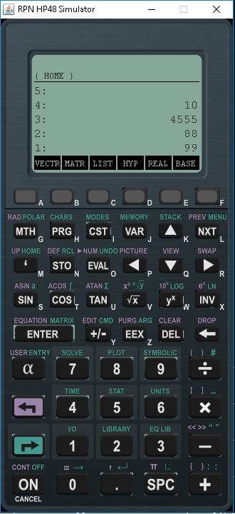

# Java - HP Calculator48

The HP 48 is a series of graphing calculators using Reverse Polish Notation (RPN) and the RPL programming

language, designed and produced by Hewlett-Packard from 1990 until 2003. The series includes the HP 48S,

HP 48SX, HP 48G, HP 48GX, and HP 48G+, the G models being expanded and improved versions of the S models.

This project is using gradle wrapper 3.5.

## Prerequisites 🚀

1. Install Windows 10
2. Install Java version 1.8.0_201

## Deploy / Installation 🔧

1. gradlew build
2. gradlew OneJar
3. gradlew copyJar
4. gradlew copyResources
5. java -jar build/JRPNHP48/JRPNHP48.jar

## Screens

  

## Contributing 🖇️

1. Fork it!
2. Create your feature branch: `git checkout -b feature/1001`
3. Commit your changes: `git commit -m 'feature/1001: Add some feature'`
4. Push to the branch: `git push origin feature/1001`
5. Submit a pull request.

## License 📄

- FREE
